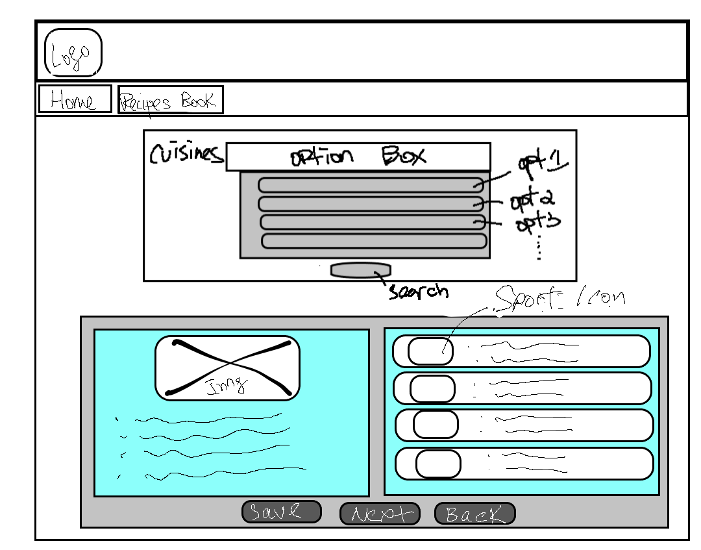
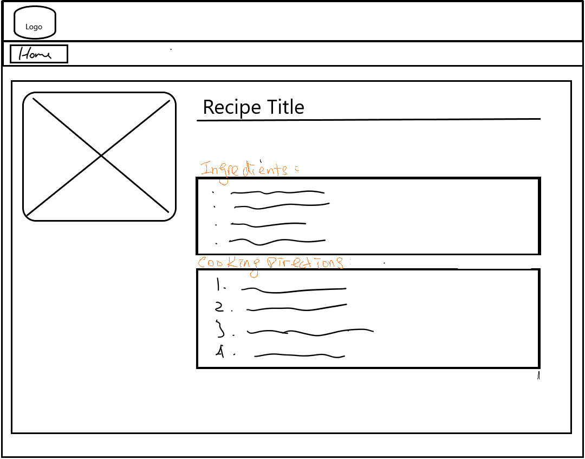
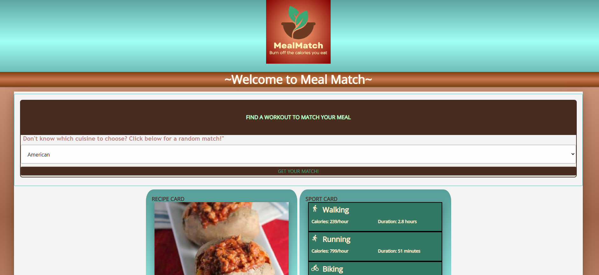
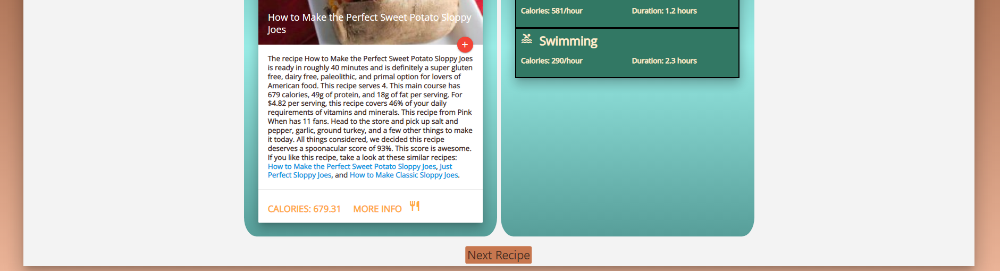
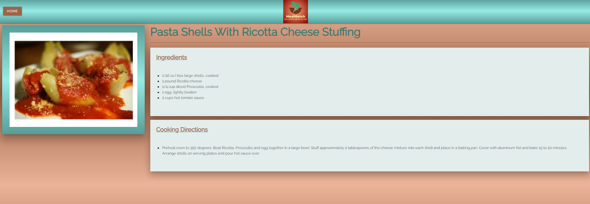
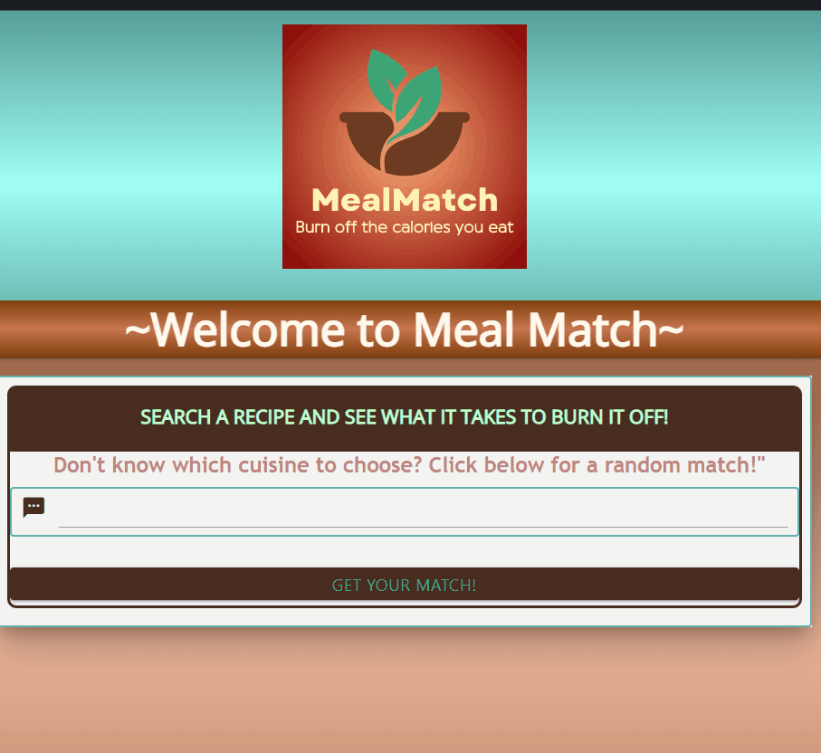

## Meal Match

### Description

MealMatch is an app designed for foodies and fitness enthusiasts alike! If you want to know what it takes to burn off the calories you just ate by doing simple exercise activities, then this app is a match for you. Users search for recipes by cuisine and are provided with a recipe that contains ingredients, cooking instructions and caloric info, as well as the activity duration needed to burn that same amount of calories. 

- [Deployed Application](https://jenho-webdev.github.io/MealMatch/)
- [Repo Wiki](https://github.com/jenho-webdev/MealMatch/wiki)

### Table of Contents
- [Technologies Used](#technologies-used)
- [Wireframe](#wireframe)
- [Usage](#usage)
- [Demo](#demo)
- [API Reference](#api-reference)
- [Color Reference](#color-reference)
- [Roadmap](#roadmap)
- [Authors](#authors)
- [Acknowledgements](#acknowledgements)
- [License](#license)

### Technologies Used

### Wireframe
- Main Page

- Recipe Page

### Usage/Examples

### Demo
Overview:

Autocomplete function:

### API Reference

#### Links to API Documentation
 - [Snoonacular](https://spoonacular.com/food-api/docs)

 - [API-Ninjas](https://api-ninjas.com/api/caloriesburned)

### Color Reference

| Hex                                                                |
| ------------------------------------------------------------------ |
 #579E99 |
 #BFFFFB |
 #98EBE5 |
 #9E6447 |
 #EBB498 |

### Roadmap

- Recipes can be saved and added to a custom book
- Recipe book access via buttons on both pages
- Recipe can be searched by keyword
- Add feedback feature
- Add hide recipe from list feature

### Authors

- Jen Ho [@jenho-webdev](https://github.com/jenho-webdev)
- Marinah Tamura [@Marinah1031](https://github.com/Marinah1031)
- Keiji Onishi [@meekunn1](https://github.com/meekunn1)
- Gilbert Perez [@Homlesscats](https://github.com/Homelesscats)
- Douglas Soda [@dsoda86](https://github.com/dsoda86)

### Acknowledgements
 
 - Shields and badges sourced from [Shield.io](https://shields.io/)

### License

